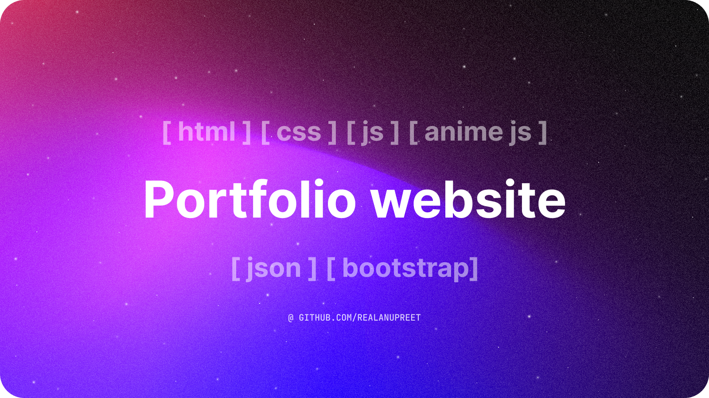

# [🥳](https://realanupreet.github.io/)

     

## 📌 Project Description

Welcome to my whimsical and playful portfolio! This is the readme file for the website that showcases my creative projects, skills, and contact information. Get ready for a delightful journey through my world of coding magic! 🌟

## 💦 Built with

- HTML
- CSS
- JavaScript
- BootStrap
- AnimeJS
- AlphineJS

## 💮 Fun Fact

The website dynamically retrieves data from the data.json file. This means that you can add new projects to the JSON file without needing to edit the HTML file every time. Simply follow the structure in data.json, and watch as the website dynamically loops over the data, creating project cards with their corresponding details. hehehe
